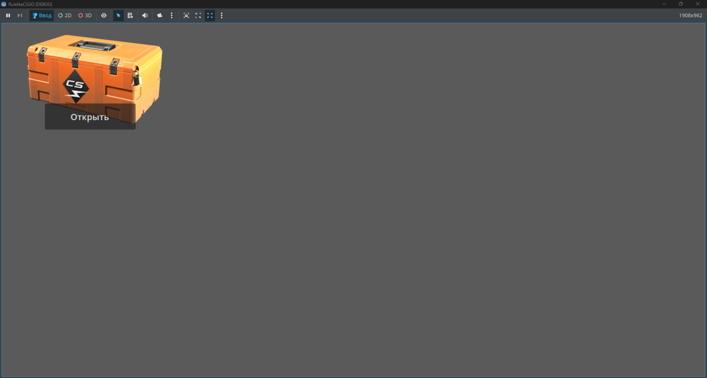
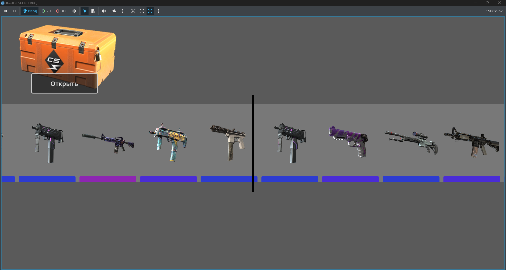
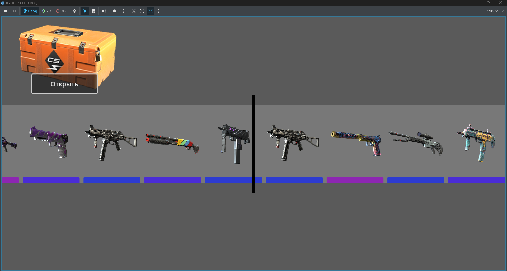
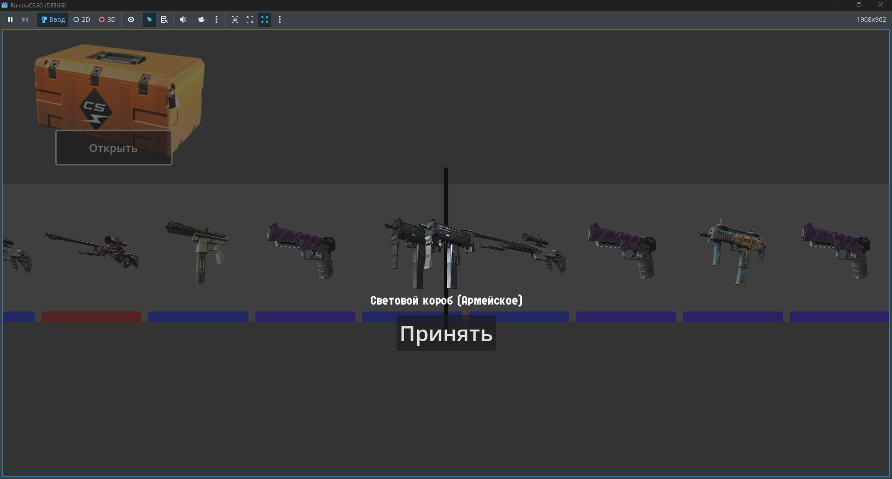

# SRouletteCSGO

**Чистая основа для симулятора открытия кейсов Godot Enginee**

## О проекте

Это голый каркас симулятора открытия кейсов. Я забросил разработку и просто выкладываю то, что есть. Здесь нет полноценной игры только рабочая основа главной механики: открытие кейса → рандомный дроп предмета. Есть сцена, простейший UI, система рандома и пара тестовых предметов. Всё сырое, но работает.

Берите и используйте как угодно:
* Вырежьте механику рандома для своего проекта
* Используйте как учебный пример для Godot
* Переделайте в нечто совершенно другое
* Оставьте как есть и забудьте

Можете не указывать авторство, но если вспомните, буду признателен.

## 📱 Соцсети

Если вдруг интересны другие мои полузаброшенные задумки:

[[YouTube](https://www.youtube.com/@pravda_sempai)
[[Rutube](https://rutube.ru/channel/41737058/)
[[VK](https://vk.com/pravdasempai)
[[Telegram](https://t.me/PRAVDASEMPAI)

## Лицензия

**Свободное использование.**  
Хотите ставьте копирайт, хотите нет. Продавайте, раздавайте, переименовывайте. Мне всё равно.

## Контакты

Не пишите мне вопросы по коду я уже всё забыл.
Но если сделаете на основе этого что-то годное кидайте ссылку в чат, гляну с любопытством.

---

Основа есть. Дальше ваша фантазия. Или нет. 🎁➡️🗑️
Когда-то начал: PRAVDA_SEMPAI
